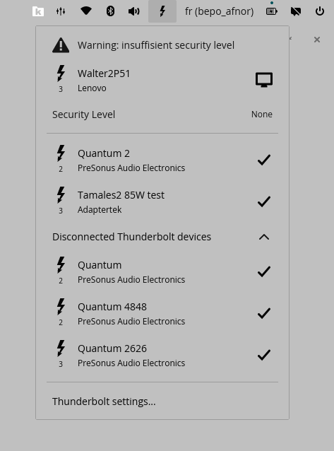
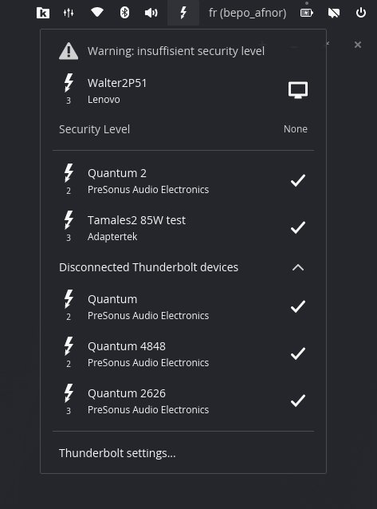

# Cosmic Ext Thunderbolt

A Thunderbolt™ applet for the COSMIC™ desktop

<!-- TODO: insert an animation -->
|                                        Light                                        |                                       Dark                                        |
|:-----------------------------------------------------------------------------------:|:---------------------------------------------------------------------------------:|
|  |  |

## Origins

Project was initialized using
the [cosmic-applet-template][cosmic-applet-template] and
the initial UI/logic iteration was heavily inspired by
the official [cosmic-applet-bluetooth][cosmic-applet-bluetooth].

Consequently, some source files retain copyright notices from System76 in
accordance with the GPL-3.0-only license.

## Requirements

- [COSMIC Desktop Environment][cosmic-de]
- [bolt thunderbolt device manager][bolt] installed
  - `boltd` running
- [Rust toolchain][rust-toolchain] for building from source

## Installation

A [justfile](./justfile) is included by default for the [casey/just][just]
command runner.

- `just` builds the application with the default `just build-release` recipe
- `just run` builds and runs the application
- `just install` installs the project into the system
- `just vendor` creates a vendored tarball
- `just build-vendored` compiles with vendored dependencies from that tarball
- `just check` runs clippy on the project to check for linter warnings
- `just check-json` can be used by IDEs that support LSP

## Configuration

Advanced users may wish to display the Thunderbolt Host Controller in the
applet list. This is hidden by default.

To show it:

1. create or edit the configuration file  
   `~/.config/cosmic/fr.doursenaud.raphael.cosmic-ext-thunderbolt/v1/show_host_device`
2. set it to `true`

## Translators

[Fluent][fluent] is used for localization of the software. Fluent's translation
files are found in the [i18n directory](./i18n). New translations may copy the
[English (en) localization](./i18n/en) of the project, rename `en` to the
desired [ISO 639-1 language code][iso-codes], and then translations can be
provided for each [message identifier][fluent-guide]. If no translation is
necessary, the message may be omitted.

## Packaging

If packaging for a Linux distribution, vendor dependencies locally with the
`vendor` rule, and build with the vendored sources using the `build-vendored`
rule. When installing files, use the `rootdir` and `prefix` variables to change
installation paths.

```sh
just vendor
just build-vendored
just rootdir=debian/cosmic-ext-thunderbolt prefix=/usr install
```

It is recommended to build a source tarball with the vendored dependencies,
which can typically be done by running `just vendor` on the host system before
it enters the build environment.

## Developers

Developers should install [rustup][rustup] and configure their editor to use
[rust-analyzer][rust-analyzer].

### Mock Mode (UI Testing)

To test the user interface without requiring physical Thunderbolt hardware
or specific UEFI/BIOS configurations, the project includes a **mock backend**.
This backend simulates various states
(insecure security levels, authentication errors, complex topologies, long device lists)
to validate the UI's responsiveness and error handling.

#### Quick Start

The easiest way to run the applet with simulated data is using
the provided `just` recipe:

```bash
just run-mock
```

This command automatically:
1. Compiles the project with the `mock` feature flag enabled
2. Sets the `COSMIC_TB_MOCK` environment variable
3. Launches the application in debug mode with full backtraces

#### Manual Usage

If you prefer using `cargo` directly:

```bash
# Build with mock support
cargo build --features mock --release

# Run with mock data enabled
COSMIC_TB_MOCK=1 RUST_BACKTRACE=full cargo run --features mock --release
```

#### Available Scenarios

The mock backend (defined in `src/mock_bolt_dbus.rs`) provides
predefined scenarios to test edge cases:
- **Insecure Security:** Simulates `Security Level: None`
  or `Legacy` with pending devices.
- **Auth Errors:** Simulates devices failing authentication
  or having unknown identities (triggering error icons).
- **Complex Topology:** Generates long lists of daisy-chained devices
  to test scrolling performance and the "Show Disconnected" dropdown.
- **Dynamic Changes:** Simulates devices connecting/disconnecting 
  or changing status periodically.

> **Note for Packagers:** The mock code is completely excluded from the binary
> when building without the `--features mock` flag
> (e.g., standard `cargo build --release` or `just build-release`).
> It adds **zero overhead** and **no security attack surface**
> to the production version distributed to users.

#### Customizing Mock Data
To test specific UI states, you can modify the `mock_daemon_task()` function
in `src/mock.rs` to return different scenarios
(e.g., `scenario_insecure_security()`, `scenario_auth_errors()`)
or cycle through them dynamically.

### References & Documentation

This project is built upon:

- The official [Linux Kernel Thunderbolt subsystem documentation][kernel-tb-doc].
  For low-level implementation details,
  refer to the [kernel driver source code][kernel-tb-src].
- Freedesktop.org [bolt][bolt]
  - [Christan Kellner's blog][ck-blog]
- Intel Thunderbolt/USB4 debugging tools: [tbtools][tbtools]
- [Thunderbolt Technology Community][tb-tech-com]

## Disclaimer

This project is independent and not affiliated with, endorsed by, or certified
by System76, Intel, USB-IF, VESA, or HDMI LA.

- **COSMIC™** is a trademark of **System76**
- **Thunderbolt™** is a trademark of **Intel Corporation**.
- **USB**, **USB Type-C®**, **USB Power Delivery™**, and **USB4®** are
  trademarks of the **USB Implementers Forum (USB-IF)**.
- **DisplayPort™** is a trademark of **VESA**.
- **HDMI®** is a trademark of **HDMI Licensing Administrator, Inc.**

Trademarks are used strictly for **descriptive purposes** to identify hardware
capabilities detected on your system. This constitutes nominative fair use.

_All trademarks remain the property of their respective owners._

_If you represent one of these organizations and have concerns about our
descriptive usage, please open an issue or contact us directly. We are happy to
discuss and adjust our assets to ensure we stay within the bounds of fair use
while keeping the tool useful for the community._

[cosmic-applet-template]: https://github.com/pop-os/cosmic-applet-template
[cosmic-applet-bluetooth]: https://github.com/pop-os/cosmic-applets/tree/master/cosmic-applet-bluetooth
[cosmic-de]: https://system76.com/cosmic
[bolt]: https://gitlab.freedesktop.org/bolt/bolt
[rust-toolchain]: https://rust-lang.org/tools/install/
[fluent]: https://projectfluent.org/
[fluent-guide]: https://projectfluent.org/fluent/guide/hello.html
[iso-codes]: https://en.wikipedia.org/wiki/List_of_ISO_639-1_codes
[just]: https://github.com/casey/just
[rustup]: https://rustup.rs/
[rust-analyzer]: https://rust-analyzer.github.io/
[sccache]: https://github.com/mozilla/sccache
[kernel-tb-doc]: https://docs.kernel.org/admin-guide/thunderbolt.html
[kernel-tb-src]: https://git.kernel.org/pub/scm/linux/kernel/git/torvalds/linux.git/tree/drivers/thunderbolt
[ck-blog]: https://christian.kellner.me/
[tbtools]: https://github.com/intel/tbtools
[tb-tech-com]: https://www.thunderbolttechnology.net/
